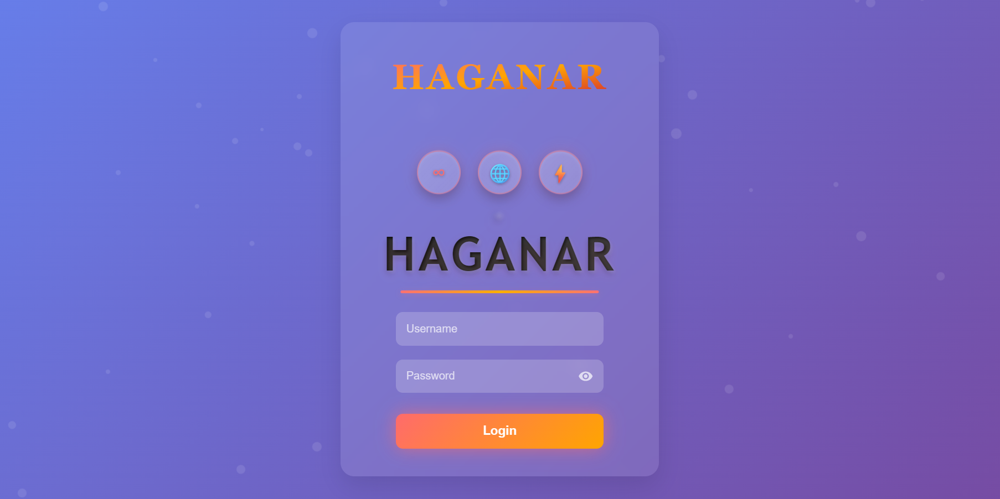

# 🔐 HAGANAR - Animated Login Page

A modern, responsive, and visually striking login interface featuring **Glassmorphism** and dynamic gradients. This project was built as a key milestone in my Web Development journey to master CSS layouts and Git version control.

## 🚀 Features
* **Glassmorphism UI:** Translucent container with backdrop filters.
* **Responsive Design:** Fully centered layout using Flexbox that works on different screen sizes.
* **Custom Branding:** Integrated custom favicon and consistent typography.
* **Animated Background:** 135-degree linear gradient for a premium feel.

## 🛠️ Tech Stack
* **HTML5:** Semantic structure.
* **CSS3:** Advanced styling including `backdrop-filter`, `linear-gradient`, and `flexbox`.
* **Git/GitHub:** Managed through VS Code for version control.

## 📸 Preview

## ✍️ Author
* **Mani (Sarikonda Manohar Raju)**
* B.Tech CSE Student | Global Institute of Engineering & Technology
* 